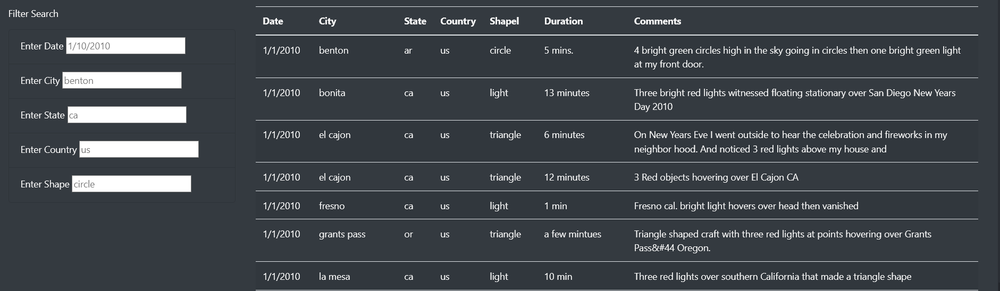
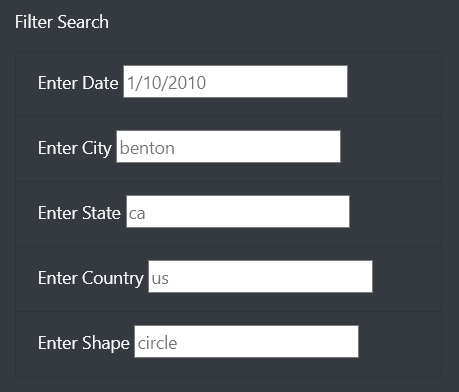
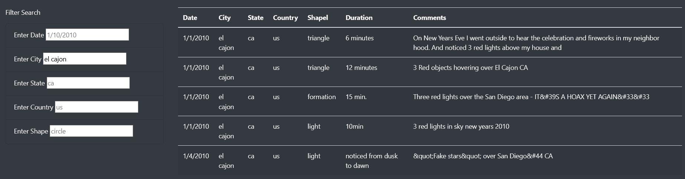
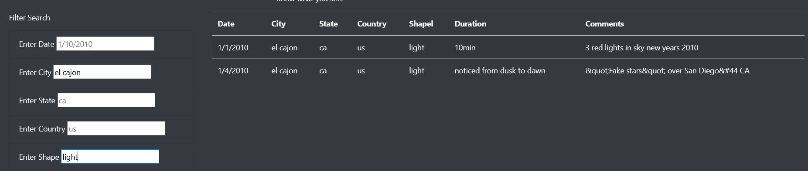
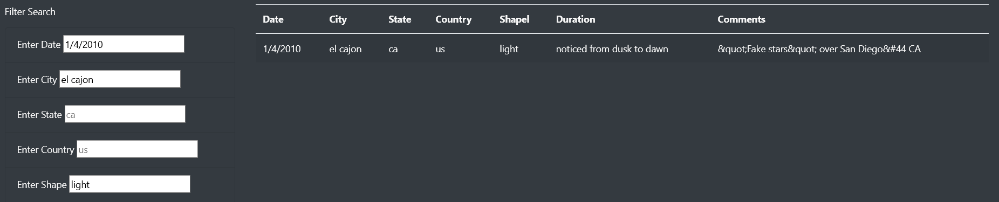

# UFO Sightings

## Overview

In this project, we analyzed data on UFO sightings, culminating in the creation of a local server that allows easy filtering of the data.

### Purpose

During this project, we sought to anlayze UFO data and create an easy-to-use, front-facing site to allow any person to easily filter through the data without needing programming or coding knoxledge. This site allows the user to perform searches on the date, city, country, state, and shape of UFO sightings within the dataset.  

## Results

Performing searches on the site is relatively easy with users able to filter by putting in their desired keywords in the filter box on the right-hand side of the page: 

Here we can more closely see the filters that the user can apply: date, city, state, country, and shape of the UFO sighting:

It should be noted that each input box has placeholder text within it, to help the user understand how queries should be templated. 

In order to apply a filter, the user only has to input what they want to filter for and then press 'Enter' or click anywhere on the screen. In this example, we are searching for sightings in the city of El Cajon:

We can also apply more than one filter at the same time! For example, if we wanted to see UFO sightings in El Cajon that were also a 'light' shape, we can do that, as seen below:

Or we could be more specific and want UFO sightings in El Cajon that were a 'light' shape on 4 January 2010:

Ultimately, the user can apply up to 5 filters (date, city, state, country, and shape) at the same time while analyzing this dataset.

## Summary

### Drawbacks

While technically impressive, this website still has some drawbacks that leaves the user wanting. For instance, the event listener within the code is only triggered by 'change'. This is effective for most situations but can sometimes mess up if the page is reloaded while inputs are stil within their boxes. In this situation, the table may not filter properly until the inputs are erased and re-entered. 

### Future Development

2 suggestions for future development
